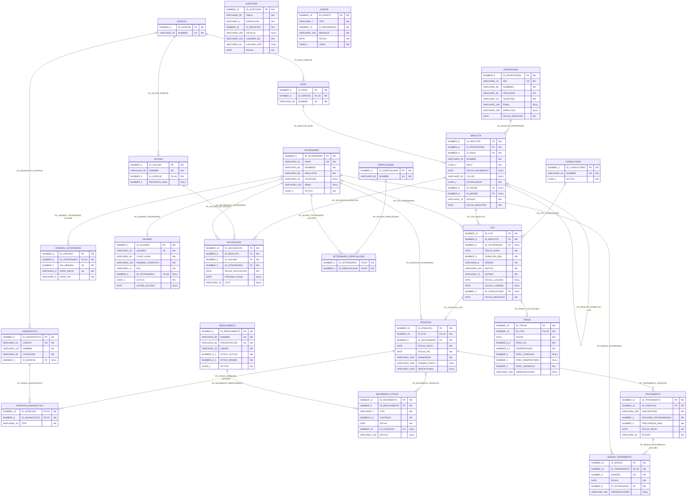

# Modelo E-R (Mermaid)

Version completa con diccionario de datos: [modelo_ER.html](modelo_ER.html)

```mermaid
erDiagram
    CITA ||--o| ATENCION : "FK_ATENCION_CITA"
    VETERINARIO ||--o{ ATENCION : "FK_ATENCION_VETERINARIO"
    ATENCION ||--o{ ATENCION_DIAGNOSTICO : "FK_ATDIAG_ATENCION (cascade)"
    DIAGNOSTICO ||--o{ ATENCION_DIAGNOSTICO : "FK_ATDIAG_DIAGNOSTICO"
    CONSULTORIO |o--o{ CITA : "FK_CITA_CONSULTORIO"
    MASCOTA ||--o{ CITA : "FK_CITA_MASCOTA"
    VETERINARIO |o--o{ CITA : "FK_CITA_VETERINARIO"
    ESPECIE |o--o{ DIAGNOSTICO : "FK_DIAGNOSTICO_ESPECIE"
    VETERINARIO ||--o{ HORARIO_VETERINARIO : "FK_HORARIO_VETERINARIO (cascade)"
    MASCOTA |o--o{ MASCOTA : "FK_MASCOTA_MADRE (set null)"
    MASCOTA |o--o{ MASCOTA : "FK_MASCOTA_PADRE (set null)"
    PROPIETARIO ||--o{ MASCOTA : "FK_MASCOTA_PROPIETARIO"
    RAZA ||--o{ MASCOTA : "FK_MASCOTA_RAZA"
    ATENCION |o--o{ MOVIMIENTO_STOCK : "FK_MOVIMIENTO_ATENCION"
    MEDICAMENTO ||--o{ MOVIMIENTO_STOCK : "FK_MOVIMIENTO_MEDICAMENTO"
    ESPECIE ||--o{ RAZA : "FK_RAZA_ESPECIE"
    TRATAMIENTO ||--o{ SESION_TRATAMIENTO : "FK_SESION_TRATAMIENTO (cascade)"
    VETERINARIO ||--o{ SESION_TRATAMIENTO : "FK_SESION_VETERINARIO"
    ATENCION ||--o{ TRATAMIENTO : "FK_TRATAMIENTO_ATENCION"
    CITA ||--o| TRIAJE : "FK_TRIAJE_CITA (cascade)"
    VETERINARIO |o--o| USUARIO : "FK_USUARIO_VETERINARIO"
    ESPECIE ||--o{ VACUNA : "FK_VACUNA_ESPECIE"
    MASCOTA ||--o{ VACUNACION : "FK_VACUNACION_MASCOTA"
    VACUNA ||--o{ VACUNACION : "FK_VACUNACION_VACUNA"
    VETERINARIO ||--o{ VACUNACION : "FK_VACUNACION_VETERINARIO"
    ESPECIALIDAD ||--o{ VETERINARIO_ESPECIALIDAD : "FK_VETESP_ESPECIALIDAD"
    VETERINARIO ||--o{ VETERINARIO_ESPECIALIDAD : "FK_VETESP_VETERINARIO (cascade)"
    ESPECIE {
        NUMBER_5 ID_ESPECIE PK "NN"
        VARCHAR2_40 NOMBRE UK "NN"
    }
    RAZA {
        NUMBER_6 ID_RAZA PK "NN"
        NUMBER_5 ID_ESPECIE FK,UK "NN"
        VARCHAR2_60 NOMBRE UK "NN"
    }
    ESPECIALIDAD {
        NUMBER_4 ID_ESPECIALIDAD PK "NN"
        VARCHAR2_60 NOMBRE UK "NN"
    }
    CONSULTORIO {
        NUMBER_3 ID_CONSULTORIO PK "NN"
        VARCHAR2_30 NOMBRE UK "NN"
        CHAR_1 ACTIVO "NN"
    }
    DIAGNOSTICO {
        NUMBER_6 ID_DIAGNOSTICO PK "NN"
        VARCHAR2_10 CODIGO UK "NN"
        VARCHAR2_120 NOMBRE "NN"
        VARCHAR2_40 CATEGORIA "NN"
        NUMBER_5 ID_ESPECIE FK "NULL"
    }
    VACUNA {
        NUMBER_5 ID_VACUNA PK "NN"
        VARCHAR2_80 NOMBRE UK "NN"
        NUMBER_5 ID_ESPECIE FK,UK "NN"
        NUMBER_4 REFUERZO_DIAS "NULL"
    }
    PROPIETARIO {
        NUMBER_8 ID_PROPIETARIO PK "NN"
        VARCHAR2_12 DNI UK "NN"
        VARCHAR2_60 NOMBRES "NN"
        VARCHAR2_60 APELLIDOS "NN"
        VARCHAR2_15 TELEFONO "NN"
        VARCHAR2_100 EMAIL "NULL"
        VARCHAR2_150 DIRECCION "NULL"
        DATE FECHA_REGISTRO "NN"
    }
    VETERINARIO {
        NUMBER_5 ID_VETERINARIO PK "NN"
        VARCHAR2_10 CMVP UK "NN"
        VARCHAR2_60 NOMBRES "NN"
        VARCHAR2_60 APELLIDOS "NN"
        VARCHAR2_15 TELEFONO "NULL"
        VARCHAR2_100 EMAIL "NULL"
        CHAR_1 ACTIVO "NN"
    }
    VETERINARIO_ESPECIALIDAD {
        NUMBER_5 ID_VETERINARIO PK,FK "NN"
        NUMBER_4 ID_ESPECIALIDAD PK,FK "NN"
    }
    HORARIO_VETERINARIO {
        NUMBER_6 ID_HORARIO PK "NN"
        NUMBER_5 ID_VETERINARIO FK,UK "NN"
        NUMBER_1 DIA_SEMANA UK "NN"
        VARCHAR2_5 HORA_INICIO UK "NN"
        VARCHAR2_5 HORA_FIN "NN"
    }
    MASCOTA {
        NUMBER_8 ID_MASCOTA PK "NN"
        NUMBER_8 ID_PROPIETARIO FK "NN"
        NUMBER_6 ID_RAZA FK "NN"
        VARCHAR2_40 NOMBRE "NN"
        CHAR_1 SEXO "NN"
        DATE FECHA_NACIMIENTO "NULL"
        VARCHAR2_40 COLOR "NULL"
        CHAR_1 ESTERILIZADO "NN"
        NUMBER_8 ID_PADRE FK "NULL"
        NUMBER_8 ID_MADRE FK "NULL"
        VARCHAR2_10 ESTADO "NN"
        DATE FECHA_REGISTRO "NN"
    }
    CITA {
        NUMBER_10 ID_CITA PK "NN"
        NUMBER_8 ID_MASCOTA FK "NN"
        NUMBER_5 ID_VETERINARIO FK "NULL"
        DATE FECHA_HORA "NN"
        NUMBER_3 DURACION_MIN "NN"
        VARCHAR2_8 ORIGEN "NN"
        VARCHAR2_200 MOTIVO "NN"
        VARCHAR2_11 ESTADO "NN"
        DATE FECHA_LLEGADA "NULL"
        DATE FECHA_LLAMADO "NULL"
        NUMBER_3 ID_CONSULTORIO FK "NULL"
        DATE FECHA_REGISTRO "NN"
    }
    TRIAJE {
        NUMBER_10 ID_TRIAJE PK "NN"
        NUMBER_10 ID_CITA FK,UK "NN"
        DATE FECHA "NN"
        NUMBER_5_2 PESO_KG "NN"
        NUMBER_3_1 TEMPERATURA "NN"
        NUMBER_3 FREC_CARDIACA "NULL"
        NUMBER_3 FREC_RESPIRATORIA "NULL"
        NUMBER_1 NIVEL_URGENCIA "NN"
        VARCHAR2_300 OBSERVACIONES "NULL"
    }
    ATENCION {
        NUMBER_10 ID_ATENCION PK "NN"
        NUMBER_10 ID_CITA FK,UK "NN"
        NUMBER_5 ID_VETERINARIO FK "NN"
        DATE FECHA_INICIO "NN"
        DATE FECHA_FIN "NN"
        VARCHAR2_1000 ANAMNESIS "NN"
        VARCHAR2_1000 EXAMEN_FISICO "NULL"
        VARCHAR2_1000 INDICACIONES "NULL"
    }
    ATENCION_DIAGNOSTICO {
        NUMBER_10 ID_ATENCION PK,FK "NN"
        NUMBER_6 ID_DIAGNOSTICO PK,FK "NN"
        VARCHAR2_10 TIPO "NN"
    }
    TRATAMIENTO {
        NUMBER_10 ID_TRATAMIENTO PK "NN"
        NUMBER_10 ID_ATENCION FK "NN"
        VARCHAR2_300 DESCRIPCION "NN"
        NUMBER_3 SESIONES_PROGRAMADAS "NN"
        NUMBER_3 FRECUENCIA_DIAS "NN"
        DATE FECHA_INICIO "NN"
        VARCHAR2_10 ESTADO "NN"
    }
    SESION_TRATAMIENTO {
        NUMBER_10 ID_SESION PK "NN"
        NUMBER_10 ID_TRATAMIENTO FK,UK "NN"
        NUMBER_3 NUMERO UK "NN"
        DATE FECHA "NN"
        NUMBER_5 ID_VETERINARIO FK "NN"
        VARCHAR2_300 OBSERVACIONES "NULL"
    }
    VACUNACION {
        NUMBER_10 ID_VACUNACION PK "NN"
        NUMBER_8 ID_MASCOTA FK "NN"
        NUMBER_5 ID_VACUNA FK "NN"
        NUMBER_5 ID_VETERINARIO FK "NN"
        DATE FECHA_APLICACION "NN"
        DATE PROXIMA_DOSIS "NULL"
        VARCHAR2_20 LOTE "NULL"
    }
    MEDICAMENTO {
        NUMBER_6 ID_MEDICAMENTO PK "NN"
        VARCHAR2_80 NOMBRE UK "NN"
        VARCHAR2_60 PRESENTACION UK "NN"
        VARCHAR2_15 UNIDAD "NN"
        NUMBER_8_2 STOCK_ACTUAL "NN"
        NUMBER_8_2 STOCK_MINIMO "NN"
        CHAR_1 ACTIVO "NN"
    }
    MOVIMIENTO_STOCK {
        NUMBER_10 ID_MOVIMIENTO PK "NN"
        NUMBER_6 ID_MEDICAMENTO FK "NN"
        VARCHAR2_7 TIPO "NN"
        NUMBER_8_2 CANTIDAD "NN"
        DATE FECHA "NN"
        NUMBER_10 ID_ATENCION FK "NULL"
        VARCHAR2_150 MOTIVO "NULL"
    }
    USUARIO {
        NUMBER_5 ID_USUARIO PK "NN"
        VARCHAR2_30 USUARIO UK "NN"
        VARCHAR2_64 CLAVE_HASH "NN"
        VARCHAR2_100 NOMBRE_COMPLETO "NN"
        VARCHAR2_11 ROL "NN"
        NUMBER_5 ID_VETERINARIO FK,UK "NULL"
        CHAR_1 ACTIVO "NN"
        DATE ULTIMO_ACCESO "NULL"
    }
    AUDITORIA {
        NUMBER_12 ID_AUDITORIA PK "NN"
        VARCHAR2_30 TABLA "NN"
        VARCHAR2_6 OPERACION "NN"
        NUMBER_12 ID_REGISTRO "NN"
        VARCHAR2_400 DETALLE "NULL"
        VARCHAR2_128 USUARIO_BD "NN"
        VARCHAR2_64 USUARIO_APP "NULL"
        DATE FECHA "NN"
    }
    ALERTA {
        NUMBER_10 ID_ALERTA PK "NN"
        VARCHAR2_7 TIPO "NN"
        NUMBER_10 ID_REFERENCIA "NN"
        VARCHAR2_300 MENSAJE "NN"
        DATE FECHA "NN"
        CHAR_1 LEIDA "NN"
    }
```
